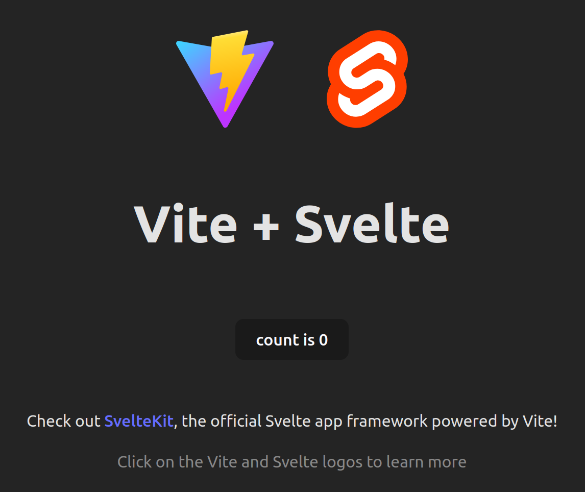
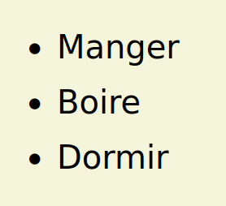
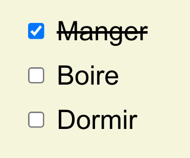
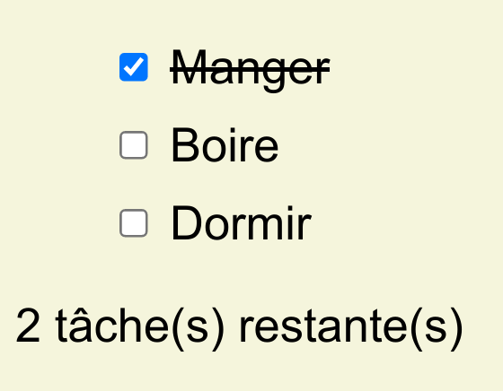
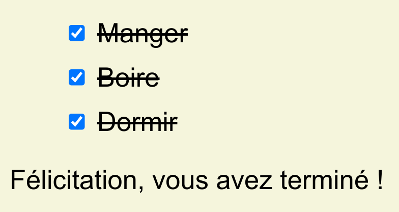
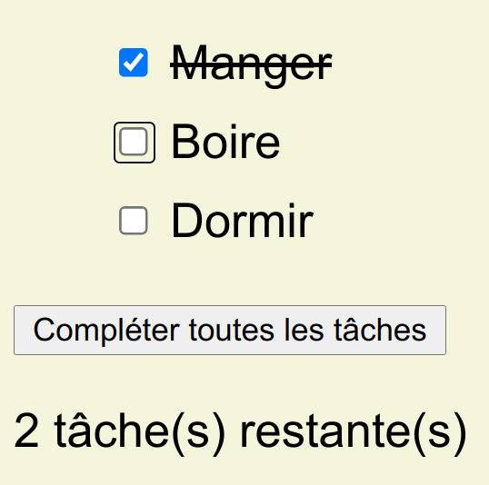
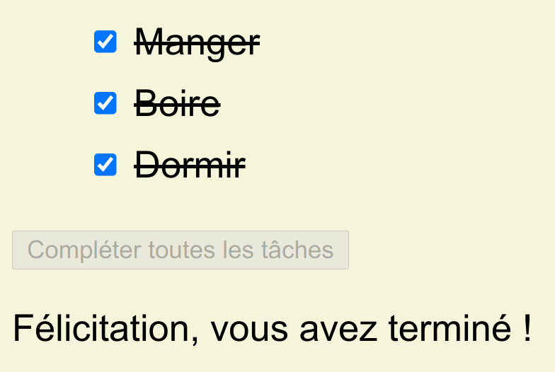
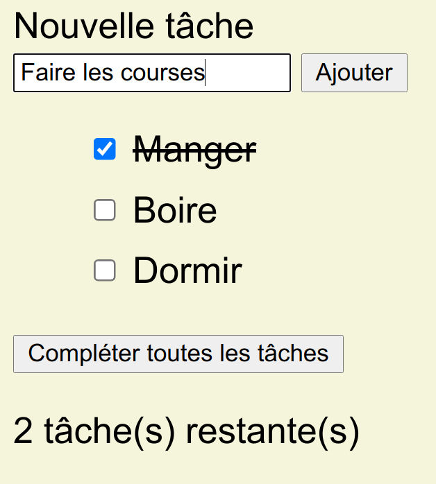

# TP Todolist avec Svelte + TypeScript

Liens utiles :

- [Tutorial de Svelte](https://svelte.dev/tutorial/basics)
- [Documentation de TypeScript](https://www.typescriptlang.org/docs/handbook/2/everyday-types.html)

## Étape 0 : Mise en place

Tout d'abord, forkez et clonez ce dépot.

En vous plaçant au sein du dossier, générez une nouvelle application avec `Vite` :

```
npm create vite@latest
```

Pour le nom du projet, utilisez le caractère point (`.`) pour que l'application soit générée dans le dossier courant.

Vite vous propose de supprimer les fichiers actuellement présents, acceptez.

Choisissez **Svelte** en tant que framework et **TypeScript** en tant que variante.

Installez les dépendances :

```
npm install
```

Enfin, lancez l'application :

```
npm run dev
```

L'application par défaut est accessible dans votre navigateur :



Pour faciliter le développement, installez l'extension [Svelte for VSCode](https://marketplace.visualstudio.com/items?itemName=svelte.svelte-vscode).

Afin de démarrer d'un environnement vierge :

- dans le fichier `App.svelte`, supprimer le contenu des balises `<script>`, `<main>` et `<style>`
- videz le fichier `app.css`

_Note : vous pouvez supprimer les autres fichiers inutiles si vous le souhaitez (`Counter.svelte`, ...), mais il peut-être intéressant de les conserver pour s'en inspirer au cours du TP._

Commitez votre travail à la fin de chaque étape.

## Étape 1 : liste des tâches

Nous travaillerons dans un premier temps dans le fichier `App.svelte`.

Voici un exemple d'interface en TypeScript représentant un film :

```ts
interface Movie {
  id: number;
  title: string;
  year: number;
  running_time: number;
  released: boolean;
}
```

Dans la partie `<script>`, créez une interface `Task` représentant une tâche à effectuer. Une tâche contient trois informations :

- un identifiant
- un nom
- un statut (effectuée ou non-effectuée)

Créez une variable `tasks` contenant un tableau de `Task`. Utilisez TypeScript pour typer la variable. Voici par exemple un tableau de films :

```ts
const movies: Movie[] = [
  {
    id: 1,
    title: 'Interstellar',
    year: 2014,
    running_time: 154,
    released: true,
  },
  {
    id: 2,
    title: 'Blade Runner',
    year: 1982,
    running_time: 121,
    released: true,
  },
];
```

Ajoutez deux ou trois tâches à votre tableau. Vérifiez que le typage fonctionne : si vous ne le respectez pas, votre éditeur doit vous en informer.

Utilisez une boucle [each](https://svelte.dev/tutorial/each-blocks) pour afficher chaque le nom de chaque tâche dans une liste au sein de la balise `<main>`.

Voici le résultat (que vous pouvez styliser selon vos envies) :



## Étape 2 : le composant `TodoList`

Une application est généralement structurée en composants : on ne va pas tout stocker dans un fichier unique. On va même essayer de le remplir au minimum.

Notre première action va donc être de déplacer notre todo list dans un composant dédié.

Créez un fichier `lib/TodoList.svelte`. Il sera structurée comme le composant `App.svelte` : une balise `<script>`, du HTML, puis une balise `<style>`.

Déplacez le contenu des balises du fichier `App.svelte` vers les balises du fichier `TodoList.svelte`.

Dans la balise `<script>` de `App.svelte`, vous aller maintenant importer votre nouveau composant :

```ts
import TodoList from "./lib/TodoList.svelte";
```

Puis vous allez pouvoir l'utiliser :

```html
<main>
  <TodoList />
</main>
```

Le résultat est le même, mais notre application est un peu plus modulaire.

## Étape 3 : état des tâches

Devant le nom de chaque tâche, affichez une [checkbox](https://svelte.dev/tutorial/checkbox-inputs) qui doit être cochée si la tâche est marquée comme réalisée. Vous devez pour cela lier l'état de la checkbox à la valeur associée à la tâche dans votre tableau de tâches.

Utilisez HTML pour lier la checkbox et le nom de la tâche grâce à la balise [label](https://developer.mozilla.org/fr/docs/Web/HTML/Element/Label) : quand vous cliquez sur le nom de la tâche, la checkbox doit être ciblée.

Grâce à CSS :
- retirez les puces de la liste
- rayez les noms des tâches cochées (sans modifier le HTML)

Voici le résultat attendu à ce stade :



## Étape 4 : compter les tâches restantes

Créez une nouvelle variable dans votre composant : `tasksLeftCount`, qui contiendra le nombre de tâches restantes.

```ts
let tasksLeftCount = ???
```

Vous pouvez compter les tâches restantes grâce à la fonction [filter](https://developer.mozilla.org/fr/docs/Web/JavaScript/Reference/Global_Objects/Array/filter). En effet, il faut filtrer les tâches en fonction de leur statut, puis les compter. Utilisez `console.log` pour vérifier que votre opération fonctionne bien.

Puis affichez le résultat sous la liste :

```html
{tasksLeftCount} tâche(s) restante(s)
```

En l'état, vous devriez observer que le nombre affiché est correct au départ, mais ne se met pas à jour quand vous cochez de nouvelles tâches.

En effet, il faut avertir Svelte que cette propriété est réactive. Pour cela, utilisez le caractère spécial `$` :

```ts
$: taskLeftCount = ???
```

L'interface doit maintenant réagir.

Enfin, si toutes les tâches sont complétées, affichez "Félicitation, c'est terminé !" à la place du décompte. Vous pouvez pour cela utiliser le [if/else de Svelte](https://svelte.dev/docs#template-syntax-if).

Voici le résultat attendu :


<br/>


## Étape 5 : bouton de complétion des tâches

Nous allons ajouter un bouton permettant de compléter toutes les tâches d'un seul coup :



Svelte permet d'appeler une fonction en réponse à un événement :

```html
<button on:click={doSomething}>
```

Créez une fonction permettant de valider toutes les tâches, puis appelez-là au clic sur le bouton.

Lorsqu'il n'y a pas de tâche à compléter, le bouton doit être désactivé :



## Étape 6 : ajout d'une nouvelle tâche

Le but de cette étape est d'ajouter un champ permettant d'ajouter une nouvelle tâche :



Pour cela, créez un composant `NewTask` que vous inclurez au dessus de la liste.

Ce composant doit contenir un formulaire composé d'un unique champ **requis**, de son label correctement associé et d'un bouton de soumission.

Lorsque le formulaire est soumis, [émettez un événement](https://svelte.dev/tutorial/component-events). Le composant parent doit récupérer l'événement et ajouter la tâche à la liste.

*Note : la soumission d'un formulaire déclenche par défaut le rechargement de la page. Pour empêchez cela, vous devrez utiliser le [modificateur d'événement](https://svelte.dev/tutorial/event-modifiers) approprié.*

Pour les attributs de la nouvelle tâche, utilisez :
- id : `Date.now()`
- nom : le contenu du champ
- statut : non effectuée

Vérifiez également que :
- le bouton de soumission est grisé lorsque le champ est vide
- le formulaire peut être soumis en cliquant sur le bouton **et** en appuyant sur entrée (avec un seul écouteur d'événement)
- le champ se vide après la soumission

## Étape 7 : utiliser un store

La définition de la liste des tâches n'a pas vraiment sa place dans le fichier `TodoList.svelte` : actuellement, notre implémentation mélange données et présentation.

Pour remédier à cela, nous allons utiliser un [store](https://svelte.dev/tutorial/store-bindings).

Créez un fichier `lib/stores.ts`. Ajoutez y un `writable` contenant la liste des tâches.

Dans `TodoList.svelte`, remplacez la définition des tâches par un appel au store créé, en vous inspirant de la documentation.

Remplacez également le code de modification des données (ajout d'une tâche, validation des tâches...) par un appel à la méthode `set` du store (voir [documentation](https://svelte.dev/tutorial/writable-stores)).

Le compteur de tâches restantes, quant à lui, peut être remplacé par un état dérivé avec la fonction `derived`. De nouveau, inspirez-vous de la documentation pour remplacer le code nécessaire.

En plus de la sépatation entre données et présentation, l'utilisation d'un store a un gros avantage : plusieurs composants peuvent s'adresser au même store sans passer par un système d'événement.

Ainsi, vous allez pouvoir supprimer le code qui permettait de faire remonter l'événement de création d'une nouvelle tâche dans `NewTask.svelte`.

À la place, l'ajout peut être effectué directement dans `NewTask.svelte`. Sans communiquer entre eux, les deux composants interagissent avec le même store, et les changements sont répercutés dans l'ensemble des composants y faisant référence.

## Pour aller plus loin...

De nombreuses améliorations sont possibles :
- Suppression d'une tâche
- Édition du nom
- Stockage dans le `localStorage`...
